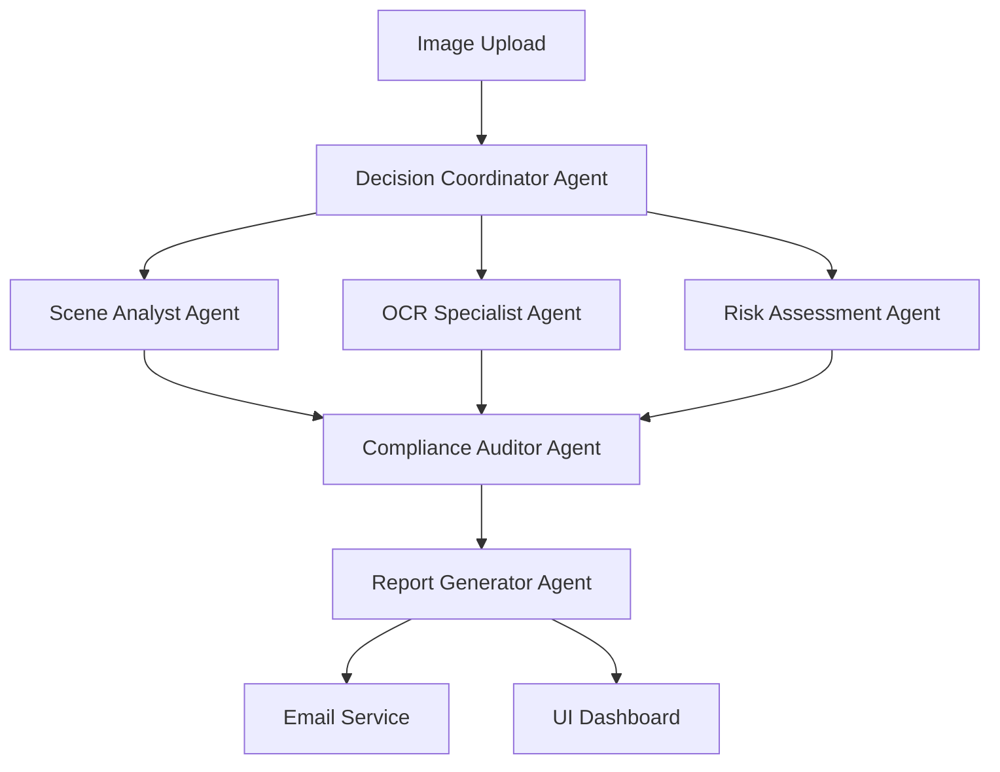

# Industrial Safety Inspection System V2.0 - Next Generation Plan

## 🎯 Current System Overview
The existing system combines manual VLM calls with CrewAI for industrial safety analysis. V2.0 will transform this into a fully agentic, high-performance, multi-use case platform.

## 🚀 V2.0 Key Improvements

### 1. **Complete Agentic Architecture**
**Current Issue**: Manual VLM calls mixed with CrewAI agents
**Solution**: Full CrewAI agent orchestration

#### New Agent Structure:
```
Vision Analysis Crew:
├── Scene_Analyst_Agent (replaces manual scene analysis)
├── OCR_Specialist_Agent (replaces manual OCR calls)  
├── Risk_Assessment_Agent (replaces manual focused reasoning)
├── Compliance_Auditor_Agent (policy enforcement)
├── Report_Generator_Agent (structured output)
└── Decision_Coordinator_Agent (orchestrates all agents)
```

#### Benefits:
- ✅ Parallel agent execution
- ✅ Intelligent task delegation
- ✅ Self-healing error recovery
- ✅ Dynamic prompt adaptation
- ✅ Memory persistence across analyses

---

### 2. **Performance & Streaming Enhancements**

#### Latency Optimization:
- **Async Agent Execution**: All agents run concurrently
- **Model Optimization**: 
  - Quantized models for faster inference
  - Model pipeline caching
  - Smart batch processing
- **Response Streaming**: Real-time partial results
- **Progressive Enhancement**: Basic results first, detailed analysis follows

#### Streaming Implementation:
```python
# New streaming architecture
async def stream_safety_analysis(image_path: str):
    yield {"status": "processing", "stage": "scene_analysis"}
    scene_result = await scene_agent.analyze_async(image_path)
    yield {"stage": "scene_analysis", "result": scene_result}
    
    yield {"status": "processing", "stage": "risk_assessment"} 
    risk_result = await risk_agent.analyze_async(image_path, scene_result)
    yield {"stage": "risk_assessment", "result": risk_result}
    # ... continue for all agents
```

---

### 3. **Expanded Use Cases & Policies (7-8 Scenarios)**

#### 1. **Construction Site Safety**
```yaml
Focus Areas:
  - Fall protection compliance
  - Scaffolding integrity
  - Heavy machinery operation
  - Excavation safety
  - Tool condition assessment
```

#### 2. **Manufacturing Floor Inspection**
```yaml
Focus Areas:
  - Machine guarding compliance
  - Lockout/Tagout procedures
  - Chemical handling protocols
  - Emergency stop accessibility
  - Hair/clothing containment
```

#### 3. **Warehouse & Logistics Safety**
```yaml
Focus Areas:
  - Forklift operation zones
  - Load stability assessment
  - Aisle clearance verification
  - Dock safety protocols
  - Fire exit accessibility
```

#### 4. **Chemical Plant Operations**
```yaml
Focus Areas:
  - Chemical PPE compliance
  - Spill containment readiness
  - Vapor detection systems
  - Emergency shower access
  - Proper labeling verification
```

#### 5. **Food Processing Facility**
```yaml
Focus Areas:
  - Hygiene compliance (hairnets, gloves)
  - Cross-contamination prevention
  - Temperature monitoring
  - Sanitization protocols
  - Foreign object detection
```

#### 6. **Mining & Excavation**
```yaml
Focus Areas:
  - Respiratory protection
  - Ground stability assessment
  - Ventilation adequacy
  - Escape route clarity
  - Equipment maintenance status
```

#### 7. **Healthcare Facility Safety**
```yaml
Focus Areas:
  - Infection control measures
  - Sharps disposal compliance
  - Patient mobility safety
  - Equipment sterilization
  - Emergency equipment access
```

#### 8. **Energy & Utilities**
```yaml
Focus Areas:
  - Electrical safety protocols
  - Arc flash protection
  - Confined space procedures
  - High voltage warnings
  - Grounding verification
```

---

### 4. **Modern UI/UX Overhaul**

#### Current State vs V2.0:
| Current | V2.0 Enhancement |
|---------|------------------|
| Basic Gradio interface | Modern React/Vue dashboard |
| Single image upload | Drag-drop multi-image batches |
| Text-only results | Interactive visual annotations |
| No progress tracking | Real-time streaming progress |
| Static reports | Dynamic, filterable reports |

#### New UI Features:
- **Interactive Image Annotations**: Click hotspots for detailed risk explanations
- **Dashboard Analytics**: Trend analysis across multiple inspections
- **Mobile-Responsive Design**: Field inspection on tablets/phones
- **Customizable Report Templates**: Industry-specific formatting
- **Multi-language Support**: Global workplace compliance
- **Dark/Light Theme Toggle**: User preference adaptation

---

### 5. **Email Alert & Reporting System**

#### Trigger-Based Email Notifications:
```python
# Email trigger configuration
email_triggers = {
    "high_risk_detected": {
        "threshold": "high",
        "immediate": True,
        "recipients": ["safety@company.com", "supervisor@company.com"]
    },
    "ppe_violation": {
        "threshold": "medium",
        "delay_minutes": 5,
        "recipients": ["hr@company.com"]
    },
    "compliance_summary": {
        "schedule": "daily_8am",
        "recipients": ["management@company.com"]
    }
}
```

#### Email Templates:
1. **Critical Alert**: Immediate safety hazards
2. **Violation Report**: PPE and compliance issues  
3. **Daily Summary**: Aggregated insights
4. **Weekly Trends**: Pattern analysis
5. **Audit Trail**: Complete inspection history

---

## 🏗️ Technical Architecture V2.0

### Core Technology Stack:
```
Frontend: React + TypeScript + Tailwind CSS
Backend: FastAPI + Python + AsyncIO
AI Framework: CrewAI + Ollama/OpenAI
Database: PostgreSQL + Redis (caching)
Deployment: Docker + Kubernetes
Monitoring: Grafana + Prometheus
```

### Agent Communication Flow:


---

## 📊 Implementation Phases

### Phase 1: Agentic Conversion (Weeks 1-2)
- [ ] Replace manual VLM calls with CrewAI agents
- [ ] Implement agent communication protocols
- [ ] Add error handling and retry logic
- [ ] Performance benchmarking

### Phase 2: Streaming & Performance (Weeks 3-4)  
- [ ] Implement async agent execution
- [ ] Add response streaming capability
- [ ] Optimize model loading and caching
- [ ] Load testing and optimization

### Phase 3: Use Case Expansion (Weeks 5-6)
- [ ] Implement 8 specialized inspection policies
- [ ] Create industry-specific agent configurations
- [ ] Add policy management interface
- [ ] Test across different industrial scenarios

### Phase 4: UI/UX Enhancement (Weeks 7-8)
- [ ] Build modern React dashboard
- [ ] Implement interactive image annotations
- [ ] Add mobile responsiveness
- [ ] User testing and refinement

### Phase 5: Email & Alerts (Weeks 9-10)
- [ ] Build email notification system
- [ ] Implement trigger-based alerts
- [ ] Create email templates
- [ ] Integration testing

---

## 🔧 Configuration Examples

### Agent Configuration:
```yaml
# config/agents.yaml
scene_analyst:
  model: "qwen3-vl:4b"
  temperature: 0.1
  max_tokens: 1000
  focus: ["people_detection", "scene_classification", "object_identification"]

ocr_specialist:
  model: "qwen3-vl:4b" 
  temperature: 0.05
  max_tokens: 500
  focus: ["text_extraction", "signage_reading", "label_detection"]

risk_assessor:
  model: "qwen3:4b"
  temperature: 0.2
  max_tokens: 1500
  focus: ["hazard_analysis", "risk_scoring", "priority_ranking"]
```

### Policy Templates:
```yaml
# policies/construction.yaml
policy_name: "Construction Site Safety"
inspection_points:
  - fall_protection
  - hard_hat_compliance
  - high_visibility_clothing
  - tool_condition
  - scaffolding_safety
severity_matrix:
  critical: ["fall_hazard", "unstable_structure"]
  high: ["missing_ppe", "unsafe_tool"]
  medium: ["minor_violation"]
  low: ["documentation_issue"]
```

---

## 🎯 Success Metrics

### Performance Targets:
- **Analysis Speed**: < 30 seconds per image (vs current ~2 minutes)
- **Accuracy**: > 95% hazard detection rate
- **User Satisfaction**: > 4.5/5 rating
- **System Uptime**: > 99.9% availability

### Business Impact:
- **Cost Reduction**: 60% less manual inspection time
- **Risk Mitigation**: 40% faster incident response
- **Compliance**: 100% audit trail coverage
- **Scalability**: Support 1000+ daily inspections

---

## 🚀 Getting Started with V2.0

### Prerequisites:
```bash
# System requirements
Python 3.11+
Node.js 18+
Docker 24+
PostgreSQL 14+
Redis 7+
```

### Quick Start:
```bash
# Clone and setup
git clone <repo>
cd industrial-safety-v2
pip install -r requirements.txt
npm install
docker-compose up -d

# Initialize database
./scripts/init_db.sh

# Start development servers
./scripts/dev_start.sh
```

### Environment Configuration:
```env
# .env.v2
AGENTIC_MODE=true
STREAMING_ENABLED=true
EMAIL_SERVICE=sendgrid
DATABASE_URL=postgresql://localhost/safety_v2
REDIS_URL=redis://localhost:6379
OLLAMA_BASE_URL=http://localhost:11434
```

---

This V2.0 plan transforms your system into a next-generation, fully agentic industrial safety platform with streaming capabilities, expanded use cases, modern UI, and intelligent alerting. Ready to revolutionize workplace safety inspection! 🏭⚡️